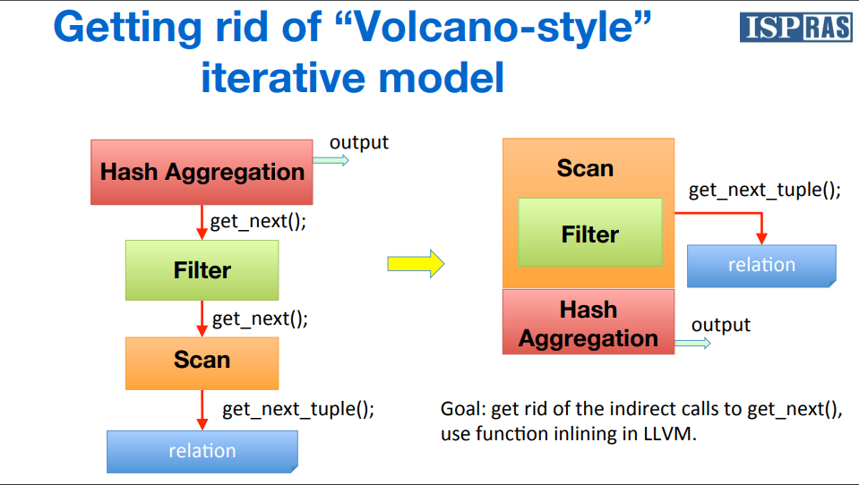
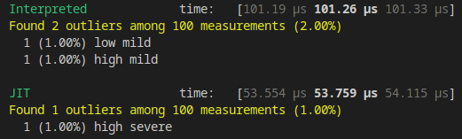

# Rust JIT demo

Making your code blazingly faster (kinda)

---

# Why use JIT anyway?

- Most Rust code doesn't need JIT.
- JIT is useful for:
  - Dynamic algorithms/pipelines (e.g. SQL queries)
  - Dynamic execution (e.g. console emulators)
  - Basically anything highly dynamic

---

# JIT case study

A common success story of adding LLVM JIT is PostgreSQL. Here's a link to the slides of one of their presentations:
[Slides](https://llvm.org/devmtg/2016-09/slides/Melnik-PostgreSQLLLVM.pdf)



<!--
In the image, you can see them comparing the "volcano model" to the new JIT approach.

Basically, the volcano model is a model where you have a bunch of operators that are chained together, and each operator is responsible for doing some work on the data, and then passing it to the next operator.

Each operator's dispatch adds overhead to the execution, and there's no way to do context-aware optimizations between the operators.

The JIT approach allows you to do operator inlining and context-aware optimizations, which can be a huge performance boost.
-->

---

# How do we JIT Rust?

After a LOT of trial and error, I decided PostgreSQL's approach is best.

It involves:
- Converting constant code modules to raw LLVM IR
- Linking the pre-compiled functions at runtime in desired ways.

They do it in C/C++, but it's possible in Rust as well.

---

# So what's the process?

In theory it's simple really.

1. Convert Rust code to LLVM IR
2. Use the pre-compiled functions at runtime to build new code to JIT
3. Cry (`[1]    68684 segmentation fault`)
4. Run the JIT code
5. Profit

---

# Step 1: Convert Rust code to LLVM IR

rustc provides a flag called `--emit=llvm-bc`, which emits the LLVM bytecode.

This returns us the LLVM IR for each compiled module (individually, unlinked).

You can also compile with `--emit=llvm-ir` to get human readable LLVM IR.

<!--
If you inspect the generated `builddir/deps/functions-{hash}.ll`, you'd notice a lot of `declare` statements for external functions.

This is because we haven't done any linking. Rust uses the LLVM linker to link the modules together, but it emits IR before performing that step.
-->

---

# Step 1.5: Linking them all together

**TL;DR:** Use LLVM to link the IR together into one module.

This is harder than it sounds, because a lot of manipulation is required here.

But a working version can be found in `./compile`.

---

# Step 1.5.5: Including `core`

There are still some missing functions, because `core` needs to be compiled to IR for linking too.

This can be done by using `-Z build-std="core,alloc"`, which requires nightly rust.

---

# More undeclared functions...

There's still functions like `__rust_alloc` and `rust_begin_unwind`.

These can be linked in at runtime, as they closely relate to the executable.

---

# Step 1.6: Optimize

Run optimization passes on the linked IR.

Keep control over what's marked public and what's private, so:
- Private stuff gets inlined more
- Unused private functions get optimized away.

---

# Step 2 (finally)

Importing these functions, and joining them together!

```llvm
define private i1 @filter(ptr %0) {
entry:
  %str = call { i64, i64 } @separated_str_as_str(ptr @str_0)
  %first_name = call { i64, i64 } @user_get_field_first_name(ptr %0)
  %starts_with = call i1 @filter_str_starts_with({ i64, i64 } %first_name, { i64, i64 } %str)
  br i1 %starts_with, label %success, label %or_middle5

fail:
  ret i1 false

success:
  ret i1 true

or_middle:
  %str128 = call { i64, i64 } @separated_str_as_str(ptr @str_32)
  ; ... and so on ...
```

---

# A note on Rust ABI

The Rust ABI is not stable, and can act in unexpected ways. For example:
```rust
#[no_mangle]
pub extern "C" fn foo() -> Vec<u8> {
    Vec::new()
}                                                                                                        ⠀
```
compiles to:
```llvm
define private void @foo(ptr (%"alloc::vec::Vec<u8>") %_0) { ; I've omitted some attributes
start:
  ; [Write to the pointer]
  ret void
}                                                                                                        ⠀
```

<!--
Keep very close attention to detail to the IR generated by rustc, and make sure you're not using the functions you exposed in ABI breaking ways.

I've found that preferring pointers is often the ideal way to go.
-->

---

# Step 3: Misery

Anyone who had the misfortune of dealing with LLVM will know.

Get ready for a lot of `[1]    68684 segmentation fault`.

`rust-lldb` is your best friend.

Also the LLVM discord server where some some American will answer your questions at 4am.

---

# Step 4: Running it!

It took me a week to figure out how to use ORC JIT (via the American I mentioned).

But, it's seamless when it actually works.

---

# Step 5: Profit


